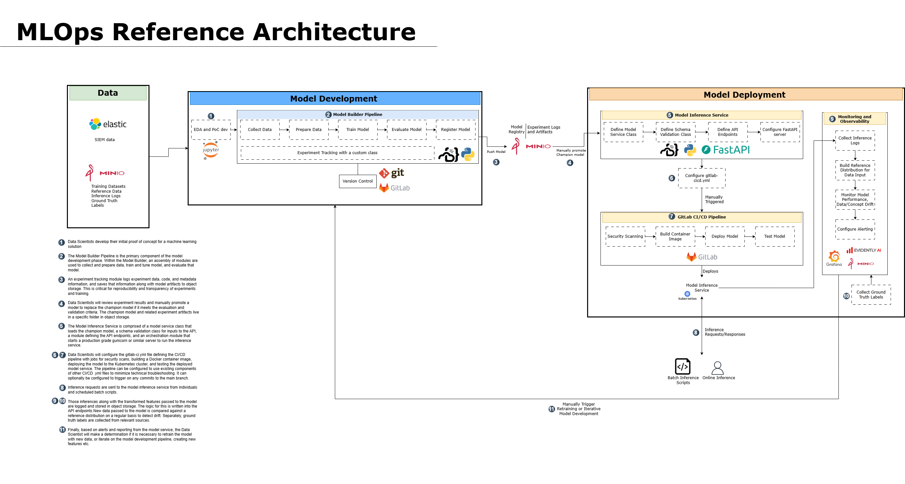

# mlops-reference-architecture

This is a reference architecture that I've built for classical ML in production. It was designed for an organization with a low level of data maturity and is not fully automated, requiring manual triggers of the model development component and manual selection of a champion model. It uses all open-source tools. A custom class was made for experiment tracking because MLFlow was not available as an option. 

